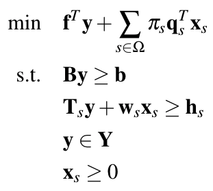

# Decomposition Algorithms for MILP using MatrixOptim.jl

The principle of decomposition as a solution technique is to break a problem down into a set of smaller problems, and, by solving the smaller problems, obtain a solution to the original problem. [2]

## 1, Benders Decomposition, MatrixOptim

According to wikipedia:

> Benders decomposition (or Benders' decomposition) is a technique in mathematical programming that allows the solution of very large linear programming problems that have a special block structure. This block structure often occurs in applications such as stochastic programming as the uncertainty is usually represented with scenarios. The technique is named after Jacques F. Benders.

### 1.1, Generic Benders Decomposition for Mixed Integer Linear Programming


```
ModMilpBenders
    sol::SolMix
        obj::Float64
        vec_result_x::Array{Float64,2}
        vec_result_y::Array{Float64,2}
    mas::ModMas
        expr::Model
        vec_y
    logs::LogHead
        next::Log
```

### 1.2, L-Shaped Benders Decomposition for Stochastic Programming without Integer Variables in Second Stage



## 2, Dantzig-Wolfe Decomposition

##

Cannot guarantee the complete privacy, because any sub-problem can be guessed from iterations.

2. Tebboth, J.R., 2001. A computational study of Dantzig-Wolfe decomposition. University of Buckingham.
