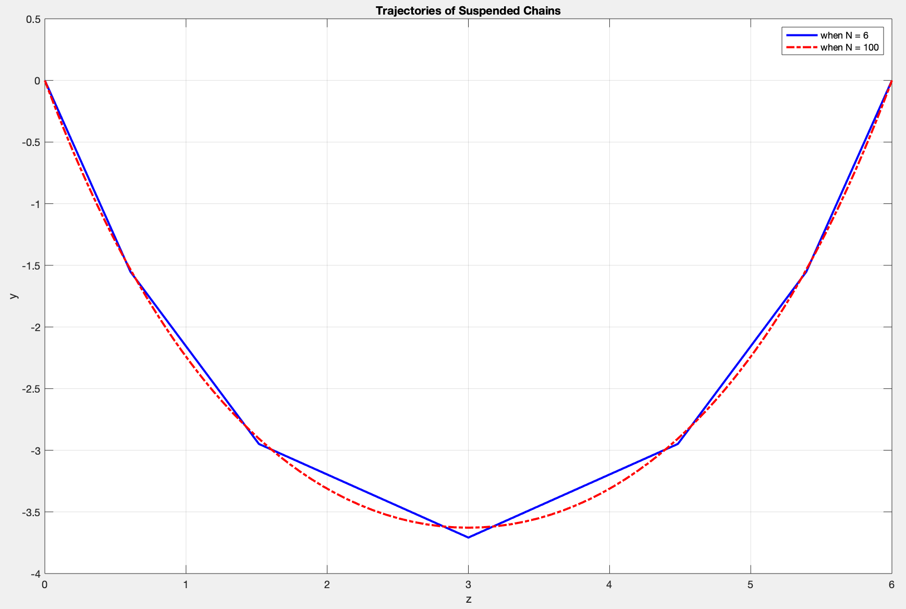

## Free DynProg with EPCs

EPCs: End Point Constraints

The problem can be interpreted to convert the system from its initial state to a given terminal state and minise the performance index at the same time.

> The terminal contribution to the performance index could be omitted, since it has not effect on the solution (except a constant additive term to the performance index). [@poulsen2012dynamic]

For a given free dynamic programming with end point constraints:
$$ \begin{align}
	\min \quad & J = \phi \left(\mathbf{x}_{N}\right) + \sum_{i=0}^{N-1} L_{i}\left(\mathbf{x}_{i}, \mathbf{u}_{i}\right) \\
	\text{s.t.} \quad & \mathbf{x}_{i+1} = \mathbf{f}_{i} \left(\mathbf{x}_{i}, \mathbf{u}_{i}\right) \quad \\
	& \mathbf{x}_{0} = \underline{\mathbf{x}}_{0} \\
	& \mathbf{x}_{N} = \underline{\mathbf{x}}_{N}
\end{align} $$
where $\mathbf{x}_i = [x_{i, 1}, x_{i, 2}, ..., x_{i, M}]^T$. Its $i$-th Hamiltonian function is:
$$ H_{i}\left(\mathbf{x}_{i}, \mathbf{u}_{i}, \lambda_{i+1}\right) = L_{i} \left(\mathbf{x}_{i}, \mathbf{u}_{i} \right) + \sum_j^M \lambda_{i+1}^{T} f_{i} \left(x_{i, j}, y_{i, j} \right) $$

The necessary condition for $\hat{\mathbf{u}}_0, \hat{\mathbf{u}}_1, ..., \hat{\mathbf{u}}_{N-1}$ being critical points is given by the Euler-Lagrange equations:
$$ \begin{align}
	x_{i+1, j} &= f_{i} \left(x_{i, j}, u_{i, j} \right) \quad \text{for } j = 1, 2, ..., M \text{ and  } i = 0, 1, 2, ..., N \quad \text{(state equations)} \\
	\lambda_{i, j} &=\frac{\partial H_{i}}{\partial x_{i, j}} \quad \text{for } j = 1, 2, ..., M \text{ and  } i = 0, 1, 2, ..., N \quad \text{(costate equations)} \\
	0 &=\frac{\partial H_{i}}{\partial u_{i, j}} \quad \text{for } j = 1, 2, ..., M \text{ and  } i = 0, 1, 2, ..., N \quad \text{(stationarity conditions)} \\
\end{align} $$
where the boundary conditions are:
$$ \begin{align}
	\mathbf{x}_{0} &= \underline{\mathbf{x}}_{0} \\
	\mathbf{x}_{N} &=\underline{\mathbf{x}}_{N} \\
	\lambda_{N, j} &= \nu + \frac{\partial \phi \left(\mathbf{x}_{N}\right)}{\partial x_{N, j}} \quad \text{for } j = 1, 2, ..., M
\end{align} $$

```{example, chain, name='Suspended Chain'}
The shape of a suspended chain can be described and solved using dynamic programming. The chain is composed of $N$ identical segments, the length of which is $l$. The position of the end of some segment $i$ can be described by a vector $[z, y]_{i}^{T}$.
```

#### Formulation of Exm \@ref(exm:chain) {-}

The equations to describe the dynamics of the chain are simplified to one dimensional unconstrained equation, and the angels are described in the Radian system. That is, For $i=0,1, \ldots N-1$, we have:
$$ \begin{align}
	\left[\begin{array}{l}{z} \\ {y}\end{array}\right]_{i+1} = f \left( \left[ \begin{array}{l}{z} \\ {y}\end{array} \right]_{i}, \left[ \begin{array}{l}{u} \\ {v}\end{array} \right]_{i} \right) &= \left[ \begin{array}{l}{z} \\ {y}\end{array} \right]_{i} + \left[ \begin{array}{l}{u} \\ {v}\end{array} \right]_{i} \\
	= f \left( \left[ \begin{array}{l}{z} \\ {y}\end{array} \right]_{i}, \theta_{i} \right) &= \left[ \begin{array}{l}{z} \\ {y}\end{array} \right]_{i} + l \left[ \begin{array}{l}{\cos \left(\theta_{i} \right)} \\ {\sin \left(\theta_{i} \right)}\end{array} \right]
\end{align} $$

where two end points of the chain are:
$$ \begin{align}
	\left[ \begin{array}{l}{z} \\ {y}\end{array} \right]_{0} &= \left[ \begin{array}{l}{0} \\ {0}\end{array} \right] \\
	\left[ \begin{array}{l}{z} \\ {y}\end{array} \right]_{N} &= \left[ \begin{array}{l}{h} \\ {0}\end{array} \right]
\end{align} $$

So the constraint $u_i^2 + v_i^2 = l^2$ is no longer needed. Notice that the angels are not constrained, but they can be estimated to be between $- 0.5 \pi$ and $0.5 \pi$.

With the new one dimensional unconstrained equation, the (steady state) potential energy can be used as the cost function:
$$ \begin{align}
	J &= \sum_{i=0}^{N-1} \frac{1}{2} m g \left( y_{i} + y_{i+1} \right) \\
	&= \sum_{i=0}^{N-1} \left[ m g y_{i} + \frac{1}{2} m g l sin(\theta_i) \right]
\end{align} $$
where the scalar $\phi$, $L$ in the standard form of the cost function can be expressed by the following equations with $N$ fixed:
$$ \begin{align}
	\phi \left( \left[ \begin{array}{l}{z} \\ {y} \end{array} \right]_{N} \right) &= 0 \\
	L \left( \left[ \begin{array}{l}{z} \\ {y}\end{array} \right]_{i}, \theta_i \right) &= m g y_{i} + \frac{1}{2} m g l sin(\theta_i)
\end{align} $$

The deterministic dynamic programming can be summarised as:
$$ \begin{align}
\min_{\theta_0, \theta_1, ..., \theta_{N-1}} \quad & J = \sum_{i=0}^{N-1} \left[ m g y_{i} + \frac{1}{2} m g l sin(\theta_i) \right] \\
\text{s.t.} \quad & \left[\begin{array}{l}{z} \\ {y}\end{array}\right]_{i+1} = \left[ \begin{array}{l}{z} \\ {y}\end{array} \right]_{i} + l \left[ \begin{array}{l}{\cos \left(\theta_{i} \right)} \\ {\sin \left(\theta_{i} \right)}\end{array} \right] \quad \text{for } i = 0, 1, ..., N-1 \\
& \left[ \begin{array}{l}{z} \\ {y}\end{array} \right]_{0} = \left[ \begin{array}{l}{0} \\ {0}\end{array} \right] \\
& \left[ \begin{array}{l}{z} \\ {y}\end{array} \right]_{N} = \left[ \begin{array}{l}{h} \\ {0}\end{array} \right]
\end{align} $$
where $z_1, z_2, ..., z_{N-1}$ and $y_1, y_2, ..., y_{N-1}$ are decision variables as well, but they are determined once $\theta_0, \theta_1, ..., \theta_{N-1}$ are chosen.

#### Solution of Exm \@ref(exm:chain) {-}

The	$i$-th Hamiltonian function of can be expressed as:

$$
H_i \left(z_i, y_i, \theta_i, \lambda^z_{i+1}, \lambda^y_{i+1} \right) = m g y_{i} + \frac{1}{2} m g l \sin(\theta_i) + \lambda^z_{i+1} \left[ z_{i} + l \cos \left(\theta_{i} \right) \right] + \lambda^y_{i+1} \left[ y_{i} + l \sin \left(\theta_{i} \right)  \right]
$$

Hence the set of Euler-Lagrange equations can be expressed by the following five equations:

$$
\begin{align}
	z_{i+1} &= z_{i} + l \cos \left(\theta_{i} \right) \\
	y_{i+1} &= y_{i} + l \sin \left(\theta_{i} \right) \\
	\lambda^{z}_{i} &= \lambda^z_{i+1} \\
	\lambda^{y}_{i} &= m g + \lambda^y_{i+1} \\
	0 &= \left[ \frac{1}{2} m g + \lambda^y_{i+1} \right] \cos(\theta_i) - \lambda^z_{i+1} \sin(\theta_i)
\end{align}
$$

where the boundary conditions are:

$$
\begin{align}
	\left[ \begin{array}{l}{z} \\ {y}\end{array} \right]_{0} &= \left[ \begin{array}{l}{0} \\ {0}\end{array} \right] \\
	\left[ \begin{array}{l}{z} \\ {y}\end{array} \right]_{N} &= \left[ \begin{array}{l}{h} \\ {0}\end{array} \right] \\
	\left[ \begin{array}{l}{\lambda_z} \\ {\lambda_y} \\ {\theta} \end{array} \right]_{N} &= \left[ \begin{array}{l}{\nu_z} \\ {\nu_y} \\ {1} \end{array} \right] \\
\end{align}
$$

Numerical method can be used to find the optimal values. The calculate procedure for iterations can be expressed by the following five equations:

$$
\begin{align}
	\lambda^z_{i+1} &= \lambda^{z}_{i} \\
	\lambda^y_{i+1} &= \lambda^{y}_{i} - m g \\
	\theta_i &= \arctan \left[ \left( \lambda^y_{i+1} + \frac{1}{2} m g \right) / \lambda^z_{i+1} \right] \\
	z_{i+1} &= z_{i} + l \cos \left(\theta_{i} \right) \\
	y_{i+1} &= y_{i} + l \sin \left(\theta_{i} \right) \\
\end{align}
$$

When $h = 6, L = 10, M = 14, N = 6$, the value of the costate vector at 0, $\left[ \lambda^{z}_{i}, \lambda^{y}_{i} \right]^{T}_{0}$, is $[-22.3645, 68.6700]$.

When $h = 6, L = 10, M = 14, N = 100$, the value of the costate vector at 0, $\left[ \lambda^{z}_{i}, \lambda^{y}_{i} \right]^{T}_{0}$, is $[-22.4092, 68.6700]$.

The two results can be visualised by the figure 1:

```{r, out.width='95%', echo=F, fig.align='center', fig.cap='Result.'}

```

#### Vertical Force and Costate Vector {-}

Determine the vertical force in the origin (i = 0). Compare this with the costate at the origin. Discuss your observations. Give a qualified guess on the sign of horizontal force in the origin.

The vertical forces at the left end and the right end are equal, and their sum equals the weight of the chain. So The vertical forces at the left end is $68.67$, which is the same value as $\lambda^{y}_{i}$.

The horizontal forces at different joints are the same. We can get the force at the end of the 2nd $f_3$ sections by analyzing the balance of 3rd and 4th sections of the chain:

$$
2 f_3 \sin \left(\theta_{2} \right) = 2 m g
$$

So we can get $f_3 = 50.2457$, so the value of horizontal force is $44.7289$, which is two times of the value of $\lambda^{z}_{0}$. When $N = 100$, $f_{50} = 44.8394$, and the value of horizontal force is $44.8183$. So we can say that the vertical force at the left end equals $\lambda^{y}_{0}$, the horizontal force at the left end is two times of $\lambda^{z}_{0}$.

### Free DynProg with Partial End Point Constraints

#### Variant of Exm \@ref(exm:chain): Two Symmetric Half Chains {-}

For $i=0,1, \ldots N-1$, we have:

$$
\begin{align}
	\left[\begin{array}{l}{z} \\ {y}\end{array}\right]_{i+1} = f \left( \left[ \begin{array}{l}{z} \\ {y}\end{array} \right]_{i}, \left[ \begin{array}{l}{u} \\ {v}\end{array} \right]_{i} \right) &= \left[ \begin{array}{l}{z} \\ {y}\end{array} \right]_{i} + \left[ \begin{array}{l}{u} \\ {v}\end{array} \right]_{i} \\
	= f \left( \left[ \begin{array}{l}{z} \\ {y}\end{array} \right]_{i}, \theta_{i} \right) &= \left[ \begin{array}{l}{z} \\ {y}\end{array} \right]_{i} + l \left[ \begin{array}{l}{\cos \left(\theta_{i} \right)} \\ {\sin \left(\theta_{i} \right)}\end{array} \right]
\end{align}
$$

where the boundary conditions are:

$$
\begin{align}
	\left[ \begin{array}{l}{z} \\ {y}\end{array} \right]_{0} &= \left[ \begin{array}{l}{0} \\ {0}\end{array} \right] \\
	z_{N / 2} &= h / 2
\end{align}
$$

Numerical method is almost the same as that in the above section. The calculate procedure for iterations can be expressed by the following five equations:

$$
\begin{align}
	\lambda^z_{i+1} &= \lambda^{z}_{i} \\
	\lambda^y_{i+1} &= \lambda^{y}_{i} - m g \\
	\theta_i &= \arctan \left[ \left( \lambda^y_{i+1} + \frac{1}{2} m g \right) / \lambda^z_{i+1} \right] \\
	z_{i+1} &= z_{i} + l \cos \left(\theta_{i} \right) \\
	y_{i+1} &= y_{i} + l \sin \left(\theta_{i} \right) \\
\end{align}
$$

The two results when $N = 6$ and $N = 100$ respectively can be visualized by the figure 2, which is the same as figure 1:

```{r, out.width='95%', echo=F, fig.align='center', fig.cap='Result.'}
knitr::include_graphics('images/Dyn-2.png')
```

### Continuous Free-DynProg-EPCs

```{example, wire, name='Trajectory of a Suspended Wire'}
Now, the chain is substituted by a wire and the problem becomes a continuous problem.
```

#### Exm \@ref(exm:chain) {-}

Let $s$ the distance along the wire. The positions along the wire obey

$$
\frac{d}{d s} \left[ \begin{array}{l}{z_{s}} \\ {y_{s}}\end{array} \right] = f(\theta_s) = \left[ \begin{array}{c}{\cos \left( \theta_{s}\right)} \\ {\sin \left( \theta_{s} \right)}\end{array} \right]
$$

where the boundary conditions are:

$$
\begin{align}
	\left[ \begin{array}{l}{z} \\ {y} \end{array} \right]_{0} = \left[ \begin{array}{l}{0} \\ {0}\end{array} \right] \\
	\left[ \begin{array}{l}{z} \\ {y}\end{array} \right]_{L} = \left[ \begin{array}{l}{h} \\ {0} \end{array} \right]
\end{align}
$$

So the potential energy in steady state can be expressed by:

$$
J = \int_{0}^{S} \rho g y / S \mathrm{d} s
$$

where

$$
\begin{align}
	\phi(\theta_S) &= 0 \\
	L(y_s) &= \rho g y / S
\end{align}
$$

The Hamiltonian function is:

$$
H_s = \rho g y / S + \lambda^z \cos \left( \theta\right) + \lambda^y \sin \left( \theta\right)
$$

Euler-Lagrange equations are:

$$
\begin{align}
	\dot{z} &= \cos \left( \theta\right) \\
	\dot{y} &= \sin \left( \theta\right) \\
	- \dot{\lambda}^z &= 0 \\
	- \dot{\lambda}^y &= \rho g / S \\
	0 &= - \lambda^z \sin \left( \theta\right) + \lambda^y \cos \left( \theta\right)
\end{align}
$$

The equations in `ode45` can be expressed as:

$$
\begin{align}
	\theta = \arctan \left(\lambda^y / \lambda^z \right)
	\dot{z} &= \cos \left( \theta\right) \\
	\dot{y} &= \sin \left( \theta\right) \\
	\dot{\lambda}^z &= 0 \\
	\dot{\lambda}^y &= - \rho g / S \\
\end{align}
$$

The results are compared with results when the number of sections of a chain is 6:

```{r, out.width='95%', echo=F, fig.align='center', fig.cap='Result.'}
knitr::include_graphics('images/Dyn-3.png')
```

<!-- or the following equations according to Pontryagins Maximum principle:

$$
\begin{align}
	- \lambda^z &= 0 \\
	- \lambda^y &= \rho M g / S \\
	\theta &= \arg \min_{-\pi/2 \leq \theta \leq \pi/2} \left[ \rho M g y / S + \lambda^z \cos \left( \theta\right) + \lambda^y \sin \left( \theta\right) \right] \\
	\dot{z} &= \cos \left( \theta\right) \\
	\dot{y} &= \sin \left( \theta\right)
\end{align}
$$

Plot the shape of the wire and discuss your observations. Determine the value of the costate vector in origin. Investigate the variation of the Hamiltonian function (i.e. the variation of the Hamiltonian as function of $s$). Plot the function as function of s and explain what you see - and why. -->
