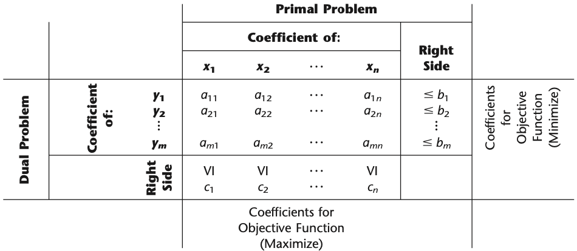

---
editor_options:
  chunk_output_type: console
# output: bookdown::gitbook
# bibliography: "../web/book.bib"
---

## Duality Theory

- [Dualization.jl](https://github.com/JuliaOpt/Dualization.jl)

```{r, out.width='55%', echo=F, fig.align='center'}

```

### Primal-Dual Table 

> The primal-dual table for linear programming (Table 6.2 ) also helps to highlight the correspondence between the two problems. It shows all the linear programming parameters (the $a_{i j}, b_{i}$ and $c_{j}$) and how they are used to construct the two problems. All the headings for the primal problem are horizontal, whereas the headings for the dual problem are read by turning the book sideways. For the primal problem, each column (except the right-side column) gives the coefficients of a single variable in the respective constraints and then in the objective function, whereas each row (except the bottom one) gives the parameters for a single contraint. For the dual problem, each row (except the right-side row) gives the coefficients of a single variable in the respective constraints and then in the objective function, whereas each column (except the rightmost one) gives the parameters for a single constraint. In addition, the right-side column gives the right-hand sides for the primal problem and the objective function coefficients for the dual problem, whereas the bottom row gives the objective function coefficients for the primal problem and the right-hand sides for the dual problem.

```{r, out.width='60%', echo=F, fig.align='center', fig.cap='Primal-Dual Table '}
knitr::include_graphics("../images/LP-2.png")
```

> Consequently, we now have the following general relationships between the primal and dual problems:  
> 1. The parameters for a (functional) constraint in either problem are the coefficients of a variable in the other problem.  
> 2. The coefficients in the objective function of either problem are the right-hand sides for the other problem.

### Primal-Dual Relationships

```{definition, name='Complementary optimal solutions property'}
At the final iteration, the simplex method simultaneously identifies an optimal solution $\mathbf{x}^{*}$ for the primal problem and a complementary optimal solution $\mathbf{y}^{*}$ for the dual problem (found in row 0, the coefficients of the slack variables, where
$$
\mathbf{c x}^{*}=\mathbf{y}^{* \mathbf{b}}
$$
The $y_{i}^{*}$ are the shadow prices for the primal problem.
```

The primal-dual relationships under all these possibilities can be summarized as: [@hillier2012introduction]

```{theorem, name='Duality'}
The following are the only possible relationships between the primal and dual problems.

1. If one problem has feasible solutions and a bounded objective function (and so has an optimal solution), then so does the other problem, so both the weak and strong duality properties are applicable.  
2. If one problem has feasible solutions and an unbounded objective function (and so no optimal solution), then the other problem has no feasible solutions.  
3. If one problem has no feasible solutions, then the other problem has either no feasible solutions or an unbounded objective function.
```

