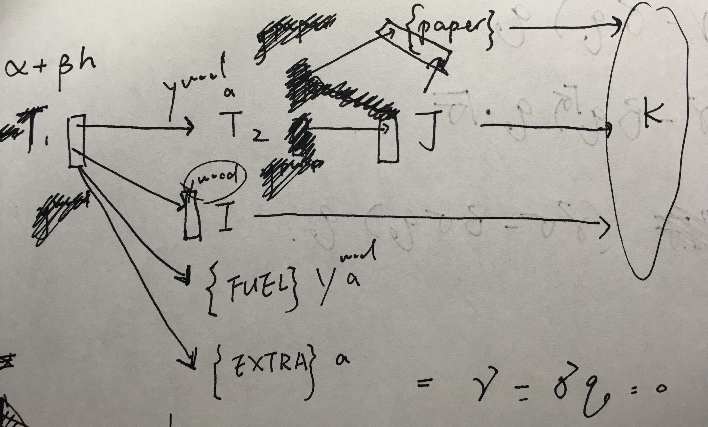

# Metsa-Oy Forest and Supply Chain 1: Static

## 1, Introduction

The supply chain is illustrated using the following figure:



## 2, Definition of Mathematical Expressions

<p align="center"></p>

_Table 1, summary of sets_

<p align="center"></p>

_Table 2, summary of decision variables_

<p align="center"></p>

_Table 3, summary of constants_

## 3, Objective Function

The Objective function composes of seven parts:

<p align="center"></p>

1. cost of timber procurement: 

2. cost of wood production: 

3. cost of pulp and paper production: 

4. profit of left timbers selling:

<p align="center"></p>

5. profit of fuel wood selling: 

6. profit of wood selling: 

7. profit of pulp selling: 

8. profit of paper selling: 

## 4, Constraints

Besides the constraints that all variables are non-negative, there are ten sets of constraints:

1. limit of timber amount in wood production:

<p align="center"></p>

2. limit of timber amount in pulp and paper production:

<p align="center"></p>

3. limit of pulp amount in paper production:

<p align="center"></p>

4. limit of wood amount in selling:

<p align="center"></p>

5. limit of pulp amount in selling:

<p align="center"></p>

6. limit of paper amount in selling:

<p align="center"></p>

7. limit of capacity in saw mill:

<p align="center"></p>

8. limit of capacity in plywood mill:

<p align="center"></p>

9. limit of capacity in pulp production:

<p align="center"></p>

10. limit of capacity in paper production:

<p align="center"></p>

## 5, Result

obj = 

Produced quantity of final products {MAS, KUS, KOS, KUV, KOV, HSEL, LSEL, PAPER} = [0, 0, 0, 0, 0, 16, 16, 80]. The units of first five quantities are , and the units of last three are .

```
result_h_t = [0, -0, -0, 77, 80, 68]
result_y_i = [0, 0, 0, 0, 0]
result_y_j = [16, 16]
result_y_paper = 80
result_z_ik = [
	0.0 130.0 58.33 50.0;
	0.0 60.0 54.17 46.67;
	0.0 35.0 31.25 32.0;
	0.0 190.0 150.0 97.22;
	537.5 292.86 162.5 126.67
	]
result_z_jk = [
	0.0 312.5 230.0 216.67;
	0.0 700.0 191.67 178.57142857142858
	]
result_z_paper_k = [24.85, 27.39, 6.16, 21.60]
```
